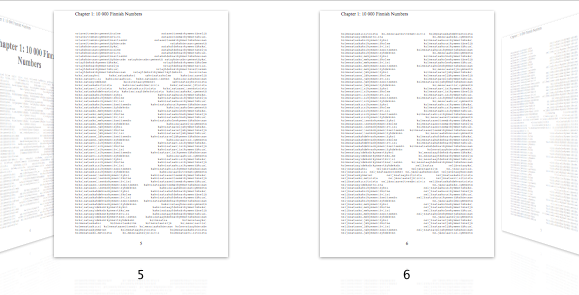
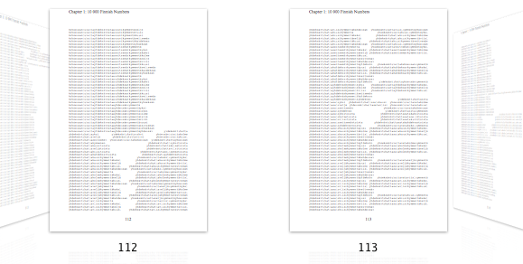
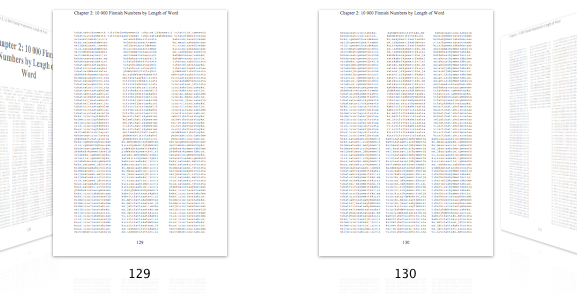
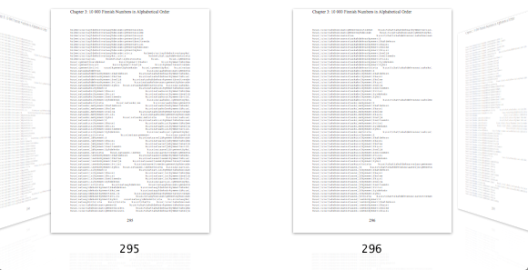
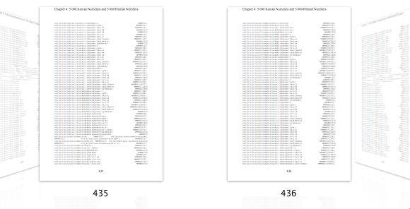

*50,000 Finnish Numbers*
========================

An entry for [NaNoGenMo 2014](https://github.com/dariusk/NaNoGenMo-2014/):

> Spend the month of November writing code that generates a novel of 50k+ words.

The rules say:

> The "novel" is defined however you want. It could be 50,000 repetitions of the word "meow". It could literally grab a random novel from Project Gutenberg. It doesn't matter, as long as it's 50k+ words.

I'd already written a [Python script](https://github.com/hugovk/fino) which, given an integer, outputs the Finnish word for that number. It's hooked up to [@EveryFinnishNo on Twitter](https://twitter.com/EveryFinnishNo) and is happily pumping out valid Finnish words every minute which have previously never been used on the internet (or at least never indexed by Google).

And given Project Gutenberg contains many classic ebooks such as *[One divided by Pi (to 1 million digits)](http://www.gutenberg.org/files/745/745.txt)*, *[The Number "e" [Natural Log] To Approximately 1 Million Places](http://www.gutenberg.org/files/127/old/ee710.txt)* and *[Miscellaneous Mathematical Constants](http://www.gutenberg.org/files/634/634.txt)* (see also [these](http://www.gutenberg.org/wiki/Mathematics_(Bookshelf)#Constants_and_Numerical_Sequences) and [those](http://www.gutenberg.org/wiki/Mathematics_(Bookshelf)#Amusements.2C_Arithmetics.2C_Recreations)), the next logical step is clearly to create an 82 825-word catalogue of numbers written out with Finnish words.

Chapters
--------

 * Chapter 1: 10 000 Finnish Numbers
 * Chapter 2: 10 000 Finnish Numbers by Length of Word
 * Chapter 3: 10 000 Finnish Numbers in Alphabetical Order
 * Chapter 4: 5 000 Roman Numerals and 5 000 Finnish Numbers
 * Chapter 5: 10 000 Alternating Finnish and English Numbers
 * Chapter 6: 10 000 Digits of Pi in Finnish

Extracts
--------

One of the best bits of the results is the patterns created on the pages.

Full catalogue
--------------

 * [PDF](Publication_Ready/50kFiNo.pdf?raw=true)
 * [TXT](Publication_Ready/50kFiNo.txt?raw=true)
 * [HTML](Publication_Ready/50kFiNo.html)
 * [MOBI](Publication_Ready/50kFiNo.mobi?raw=true)
 * [MMD](Publication_Ready/50kFiNo.mmd?raw=true)

Thanks
------

Thanks to [Ian Hocking](http://ianhocking.com/2013/06/23/writing-a-novel-using-markdown-part-two/) for [create_ebooks_from_markdown.sh](create_ebooks_from_markdown.sh), modified and included here.

See also my first entry, *[50,000 Meows](https://github.com/hugovk/meow.py/)*.
